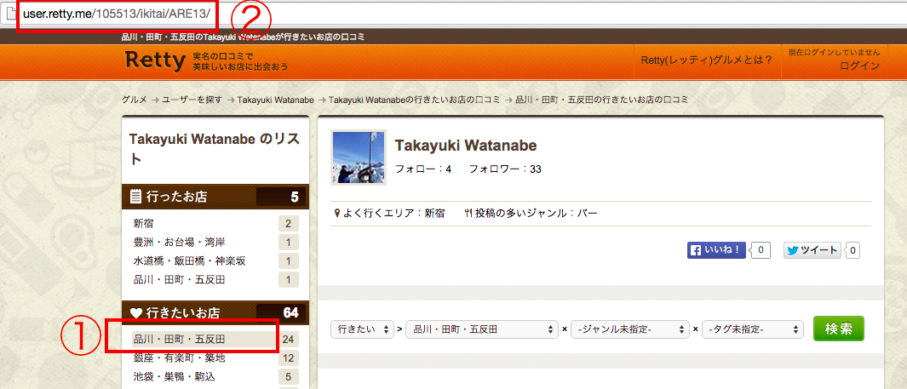

# hubot-retty
hubot-retty is a hubot script that display information regitstered in Retty wanna go lists.

## Installation

In hubot project repo, run:

`npm install hubot-retty --save`

Then add **hubot-retty** to your `external-scripts.json`:

```json
[
  "hubot-retty"
]
```

## Usage
Find your favorite user from ![Retty user seach] and select `①行きたいお店`show in follwing picture. Then, you can find the user's unique ②URL that shows us wanna go list.



Set Retty ②URL

```
#node_modules/hubot-retty/src/retty.coffee

    # send HTTP request
    base_url = '②RETTY_WANNA_GO_LIST_URL'
    client.fetch base_url, {}, (err, $, res) ->

```
Now, we can use hubot-retty script.

## Sample Interaction

```
takanabe >> hubot retty
hubot>>
葱や平吉 芝店 http://retty.me/area/PRE13/ARE13/SUB1302/100000040232/
 田町 居酒屋,田町 創作料理

フィオーレ http://retty.me/area/PRE13/ARE13/SUB1302/100001196873/
 田町 イタリア料理

キッチン　ばんばんざい http://retty.me/area/PRE13/ARE13/SUB1302/100000089731/
 田町 居酒屋,田町 フレンチトースト

鮨はな http://retty.me/area/PRE13/ARE13/SUB1302/100000920150/
 田町 寿司

和洋食　さくら寿司 http://retty.me/area/PRE13/ARE13/SUB1302/100000037936/
 田町 カツ丼,田町 寿司,田町 洋食,田町 ドーナツ,田町 プリン

宮崎県日南市　塚田農場 田町店 http://retty.me/area/PRE13/ARE13/SUB1302/100000004867/
 田町 日本料理,田町 焼き鳥,田町 もつ鍋,田町 居酒屋,田町 炭火焼き

東京厨房 三田店 http://retty.me/area/PRE13/ARE13/SUB1302/100000038929/
 田町 洋食,田町 定食

```

## In the future ...
This hubot script will be changed when Retty release public API.
